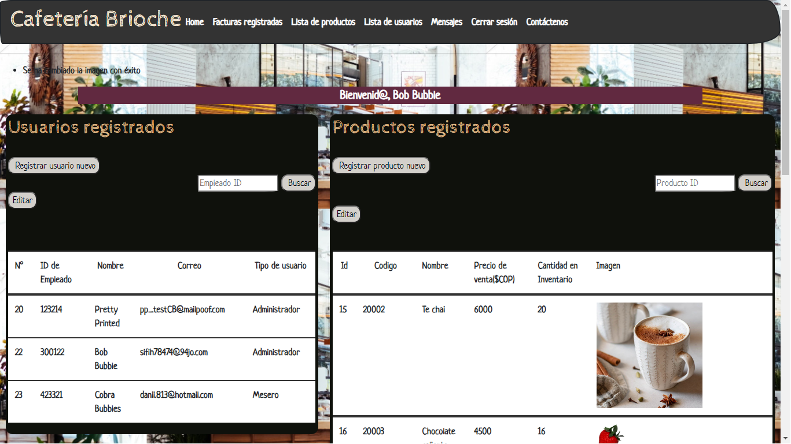

Brioche Cafeteria
Project of the third module of ICT Mission 2022, involved the preparation, design, implementation and deployment of the web application. A web app was developed for a coffee shop to manage orders and employee accounts in the business.

It has:

Login Authentication
Receiving PQRS via email
Managing Administrator and Waiter Accounts
Cafeteria menu and inventory, with product management features

